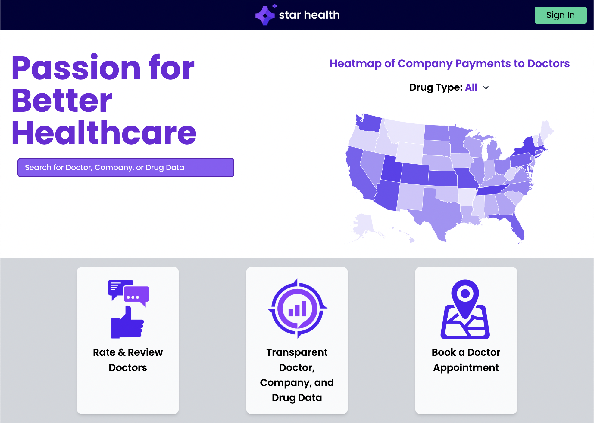
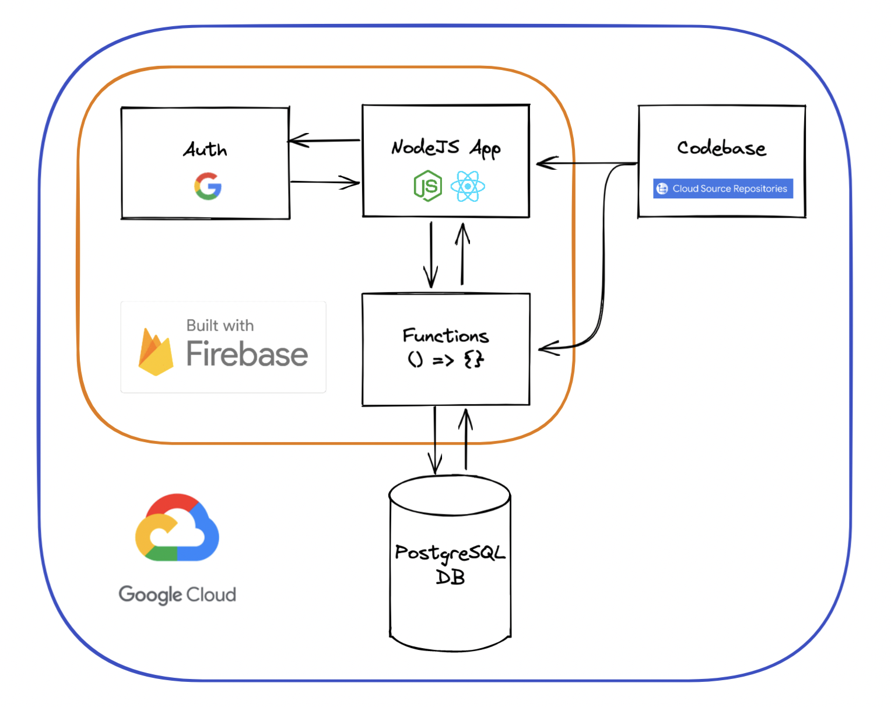
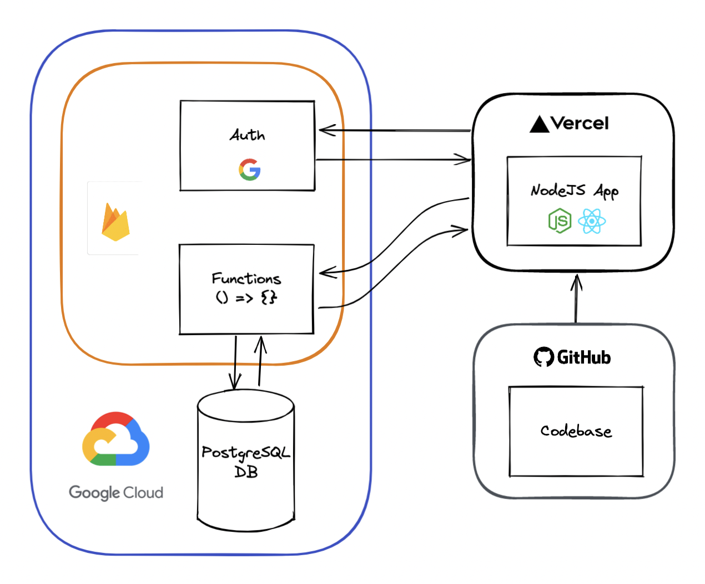
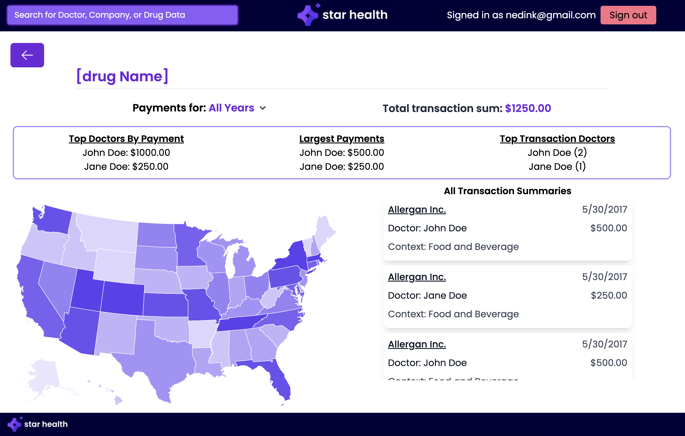

# Star Health

https://starhealth.io/

Star Health is a public data analytics platform focused on healthcare. It strives to make public medical data more accessible to the general public.




## Architecture

The platform consists of:
- [React](https://reactjs.org/) app hosted on [GitHub](https://github.com/utshabnc/Star-Health) and deployed on [Vercel](https://vercel.com/)
- [PostgreSQL](https://www.postgresql.org/) [database](https://console.cloud.google.com/sql/instances/starhealth/overview?project=starhealth-io)
- Serverless functions on [Google Cloud Functions](https://cloud.google.com/functions)
- [Firebase Authentication](https://firebase.google.com/docs/auth)
- [Google Cloud Platform project](https://console.cloud.google.com/welcome?project=starhealth-io)
- [Firebase project](https://console.firebase.google.com/project/starhealth-io/overview)

[View diagram](#current-architecture)

## App

This app is built with:
- [Node.js](https://nodejs.org/en/)
- [React](https://reactjs.org/)
- [Prisma](https://www.prisma.io/)
- [PostgreSQL](https://www.postgresql.org/)
- [TypeScript](https://www.typescriptlang.org/)
- [Tailwind](https://tailwindcss.com/)
- [Vite](https://vitejs.dev/)
- [Firebase](https://firebase.google.com/docs/reference/node)


## Quick Start

>This project requires [Node.js](https://nodejs.org/en/) and [Git](https://git-scm.com/). Make sure they are installed in your local development environment. You can check that they are by running:
>```
>git --version
>
>node --version
>```

1. Clone the project and navigate to it.
```
git clone https://github.com/utshabnc/Star-Health.git

cd Star-Health/
```

2. Install packages.
```
npm install
```

3. Run in development mode.
```
npx vite dev
```

4. Open in browser at http://localhost:5173/.
```
  VITE v3.0.9  ready in 217 ms

  ➜  Local:   http://localhost:5173/
  ➜  Network: use --host to expose
```


## Development

Check the [technology stack](#current-architecture) listed above and review their introductory documentation.

Create a new branch for any significant change. Commit messages should be short and descriptive, i.e. `fix dropdown behavior`.

> Before you commit, make sure you have only the relevant changes staged.

Open [pull request](https://github.com/utshabnc/Star-Health/pulls) to `main` and request review from a teammate.

On push/merge, the app is automatically deployed on Vercel to `preview` and to `production` with changes to `main`.

### File Structure
```
root
|_ functions/
|  |_ prisma/
|  |  |_ schema.prisma
|  |_ src/
|  |  |_ doctor.ts, manufacturer.ts...
|  |_ package.json
|
|_ src/
|  |_ components/
|  |_ pages/
|  |  |_ DoctorDetials/, DoctorReviews/...
|  |_ utils/
|  |_ ...
|
|_ index.html
|_ package.json
|_ ...config/env files (TypeScript, Vite, etc.)
```


### Migration from GCP

The goal of this effort is to move out of GCP in favor of more modular, light-weight solutions like GitHub and Vercel.

Initially, the codebase, database, authorization, app and function deployements were built for and hosted on GCP + Firebase:

### Legacy Architecture


(Nov 8, '22) The code and app deployments have been moved to GitHub and Vercel:

### Current Architecture



Possible future replacements:
- PlanetScale to house the data
- Serverless functions on Vercel
- NextJS for NextAuth (and other benefits)


### Drug Page



The drug page has been scaffolded out but is not hooked up to the database yet. Currently, although the database contains relevant data for this page, it is not indexed to support efficient querying of the data by drug specifically. 

This initial implementation of the page layout contains the following:
- A detail section containing:
  - Top Doctors By Payment (doctors with the largest total payments for the drug)
  - Largest Payments (largest single payments for the drug)
  - Top Transaction Doctors (payment count per doctor for payments for the drug)
- A map of the United States to show geographical patterns in transaction count, cost, or other variables relating to the drug (to be titled + included with a dropdown)
- A list of transactions for the drug

> To the developer: This section is meant to be temporary. Remove it once the drug page has been implemented.